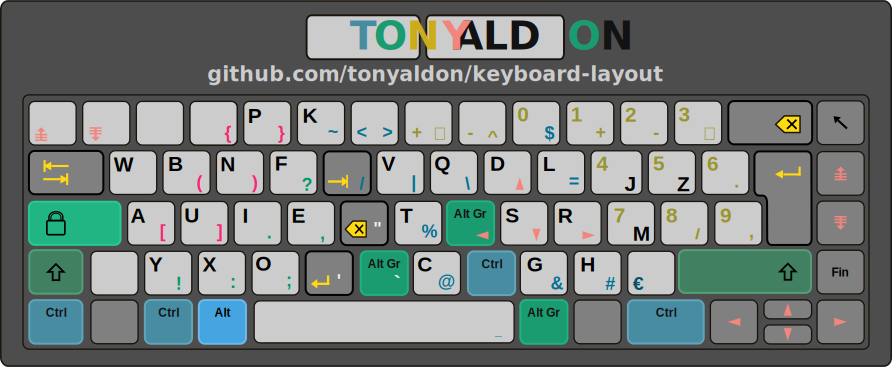
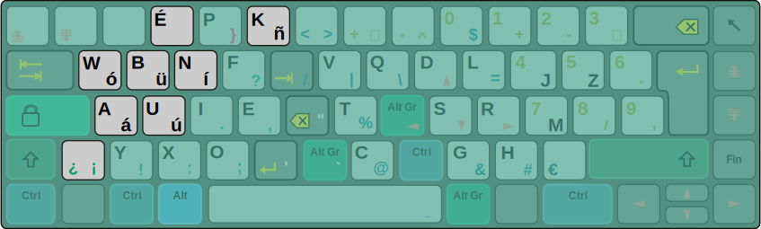
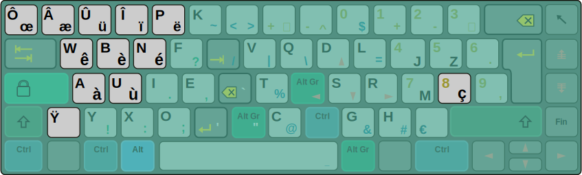

# About

`keyboard-layout` pools all files needed to set up my custom
[XKB](https://wiki.archlinux.org/index.php/X_keyboard_extension)
keyboard layout (`takbl`).

# Layouts

## takbl basic

<p align="center">
	<figure>
	
	</figure>
<p/>

## takbl Spanish variant

<p align="center">
	<figure>
	
	</figure>
<p/>

## takbl French variant

<p align="center">
	<figure>
	
	</figure>
<p/>

# Motivation

1. I want a keyboard layout that fits my needs (I mostly use my
   keyboard to write **CODE**).
2. After typing all day long, my hands and fingers use to hurt me.
   This is principaly due to the use of the **PINKY** on the keys
   `Backspace`, `Control`, `Enter`, `Shift` and `Tab`.
   [TypeMatrix](http://www.typematrix.com/) does a great job in this
   area puting `Backspace` and `Enter` in the center of the
   keyboard.  But It's not enougth when you're writing code because
   you want the `Tab` key in the center (_is there anyone who writes
   code without code completion or snippet expansion almost always
   bound to the `Tab` key?_).  Moreover, `TypeMatrix` put the symbols
   `[`, `]`, `(`, `)`, `{`, `}` in the edges, which is bad when you
   write code.
3. When you write code, you use the symbols `[`, `]`, `(`, `)`, `{`,
   `}` constantly, **SO** they **CAN'T** be at the edges of your
   keyboard layout.  This is why I discarded the keyboard layouts
   [QWERTY](https://en.wikipedia.org/wiki/QWERTY) and
   [DVORAK](https://en.wikipedia.org/wiki/Dvorak_keyboard_layout)
   (also due to the **PINKY** problem of the keys `Backspace`,
   `Control`, ... described above).
4. As I'm French, I had a look on
  [BÉPO](https://en.wikipedia.org/wiki/B%C3%89PO).  Two things are
  good in the layout: 1) the symbols `[`, `]`, `(`, `)`, `{`, `}` are
  not at the edges (accessible with key-chords using `Alt Gr` key), and 2)
  the punctuation symbols `.`, `:`, `,`, `;` are at the center of the
  keyboard.  However I discarded it because of the **PINKY** problem
  of the keys `Backspace`, `Control` ... described above.
5. In addition, I want to access to the symbols `_` `'` `"` `/`
   `|` `\` `%` `@` `#` `=` `$` `~` `<` `>` `+` `*` `-`
   `^` `!` `?` without moving my hands.

# Learning a new keyboard layout
...
# Installation

This configuration works on linux ubuntu 18.04 LTS.

To install `takbl` keyboard layout, run the following commands:

	git clone https://github.com/tonyaldon/keyboard-layout
	cd keyboard-layout
	make install

If you want to remove the `takbl` keyboard layout installation, run
the command:

	make remove

Note that when you run `make install`, 4 things happen:
1. A backup of the files `/usr/share/X11/xkb/rules/evdev.xml` and
   `/etc/default/keyboard` is made in the directory `.backup`,
2. The keyboard layout `takbl` is installed by making the following
   hardlinks:

        /usr/share/X11/xkb/rules/evdev.xml => usr/share/X11/xkb/rules/evdev.xml
        /usr/share/X11/xkb/symbols/takbl => usr/share/X11/xkb/symbols/takbl

3. The keyboard layout `takbl` becomes the default keyboard layout by
   making the following hardlink:

        /etc/default/keyboard => etc/default/keyboard

4. And the keyboard layout `takbl` is activated for the current session.

If you want to know more about `XKB`, you can read the section [My
understanding of XKB](#my-understanding-of-xkb)

# Variants

`takbl` is **designed** to be used to **write code**.  However
sometimes, I write some _Spanish_ or _French_.  For that reason, I
added two variants `takbl es` and `takbl fr` to the basic layout
`takbl.`

- For the _Spanish_ layout, I added the following characters: `á` `é`
  `í` `ó` `ú` `ü` `ñ` `¿` `¡`.
- For the _French_ layout, I added the following characters: `à` `â`
  `æ` `é` `è` `ê` `ë` `î` `ï` `ô` `œ` `ù` `û` `ü` `ÿ` `ç`.

Not that when you load a variant you lose some characters very useful
when you're programming but not when you are writing standard text.
It doesn't bother me because:
1. I'm not a French nor a Spanish novel writer, I write code and code
   documentation and when I write some Spanish or French I'm not
   writing code.
2. I almost always write inside
   [emacs](https://www.gnu.org/software/emacs/) where I have a key
   binding with which I can switch quickly between the keyboard
   layouts `takbl`, `takbl es` and `takbl fr`.
3. By the way, there is always a **TRADEOFF**.

To switch between those variant, you can run the following commands:

	setxkbmap -layout takbl              # basic
	setxkbmap -layout takbl -variant es  # Spanish
	setxkbmap -layout takbl -variant fr  # French

# My understanding of XKB

## XKB

### How does XKB load a keyboard layout?

When you load a keyboard layout, for instance by running the command
`setxkbmap -rules evdev -layout us` (for the standard US QUERTY),
`XKB` load the rules in `/usr/share/X11/xkb/rules/evdev.xml` file and
looks for the layout `us`.  If the layout `us` is found in
`/usr/share/X11/xkb/rules/evdev.xml`, `XKB` seeks the file
`/usr/share/X11/xkb/symbols/us`.  If this file exist, the keyboard
layout defined in that file is loaded (in our case the US QUERTY
layout is loaded).

The directory `/usr/share/X11/xkb/` looks like this:

```
.
├── compat
│   ├── ...
├── geometry
│   ├── ...
├── keycodes
│   ├── ...
├── rules
│   ├── ...
│   ├── base.xml
│   ├── evdev.xml
│   ├── ...
├── symbols
│   ├── ...
│   ├── fr
│   ├── ...
│   ├── us
│   ├── ...
└── types
    ├── ...
```

### How to list all the XKB keyboard layouts?

To see all the keyboard layouts available, list the files in the directory
`/usr/share/X11/xkb/symbols/` by running the command:

	ls /usr/share/X11/xkb/symbols/

### Why does XKB choose to load the rules in the file `evdev.xml` and not `base.xml`?

I don't know, but in the documention we can read that *On Linux
systems, the `evdev` rules are most commonly used, on other systems
the `base` rules are used*.

So like me if you're running Linux Ubuntu, the rules XKB loads are
in the file `/usr/share/X11/xkb/rules/evdev.xml`.  And if you are
using `setxkbmap` to load keyboard layouts, running one of those
following command lines leads to the same result (loading the US
QUERTY keyboard layout):

	setxkbmap -layout us
	setxkbmap -rules evdev -layout us

### How to set a default keyboard layout that last across sessions?

Setting your keyboard layout with `setxkbmap` doesn't last across
sessions and as a consequency is not set when you log into your
session.

Your system load the keyboard layout set in `/etc/default/keyboard`
file.  For instance, if you use the US QUERTY keyboard layout,
`/etc/default/keyboard` file should look like this:

```
# KEYBOARD CONFIGURATION FILE

# Consult the keyboard(5) manual page.

XKBMODEL="pc105"
XKBLAYOUT="us"
XKBVARIANT=""
XKBOPTIONS=""

BACKSPACE="guess"
```

Now if you want to set the Spanish QUERTY keyboard layout (that is defined in the file
`/usr/share/X11/xkb/symbols/es`) as your default keyboard layout, you
just have to modify the line `XKBLAYOUT="us"` by `XKBLAYOUT="es"` in
the file `/etc/default/keyboard`, which lead to the file:

```
# KEYBOARD CONFIGURATION FILE

# Consult the keyboard(5) manual page.

XKBMODEL="pc105"
XKBLAYOUT="es"
XKBVARIANT=""
XKBOPTIONS=""

BACKSPACE="guess"
```


### How do I get the current XKB settings?

If you want to have some informations on your current XKB settings ,
run the commands:

    setxkbmap -query
    setxkbmap -query -verbose 10

# Contact

Do you have any question or suggestion? Please, feel free to:
* leave me a message on twitter <a
href="http://www.twitter.com/tonyaldon">@tonyaldon</a>
* or to email me at tony.aldon.adm@gmail.com.

**Speaking with your computer always starts by typing
characters. Speak clearly. Have a better life.**
