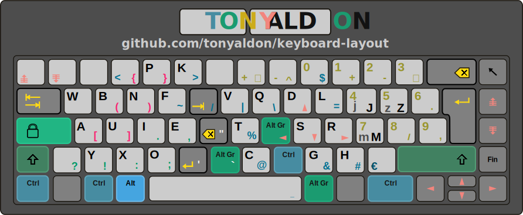

# About

`keyboard-layout` pools all files needed to set up my own keyboard
layout.

<p align="center">
	<figure>
	
	<figcaption>Tony Aldon (kbl basic)</figcaption>
	</figure>
<p/>

# Motivation 
I wanted to have a keyboard layout that realy fit with my daily work and computer use. 
With the standard existing keyboard layouts as *qwerty* or *bépo*, I used to have these problems:

1. After a typing day work, my hands and fingers hurt me,
2. The more significant keys *Tab, Return, Backspace, Control* are on
   the keyboard edges and used by the pinky,
3. I couldn't write freely:
   * impossible to switch easily between *english*, *french* (which requires characters like *é,è,ê,ù,ç,..*, and *spanish* (which requires characters like *ñ,¡,¿,...*),
   * impossible to have high focus when coding, due to the random position of vital characters as *[,],(,),{,},#,|,%,@,&,...*.

# Installation

This configuration works on linux ubuntu 16.04 LTS (maybe later release too but not tested).

Download this directory, then go to `keyboard-layout` directory, make the file `install.sh`
executable, and run it.

```bash
cd your-path-to/keyboard-layout
chmod +x install.sh
sudo ./install.sh
```
Now, you have to restart your computer to make changes effective.

[warning] `install.sh` will change the important system file
`evdev.xml` after having made a backup. Make sure you agree with this.

# Usage

If you have run the installation step above, you can use the keyboard
layout `Tony Aldon (kbl basic form)` only by active it in the `Text
Entry Settings`.

Go to: `System Settings > Keyboard > Typing > Text Entry`, then  click on `+` and
choose `Tony Aldon (kbl basic form)`.

Or, if you prefer you can run `setxkbmap -layout takbl` in your terminal.

# Contact

Do you have any question or suggestion? Please, feel free to:
* leave me a message on twitter <a
href="http://www.twitter.com/tonyaldon">@tonyaldon</a> 
* or to email me at aldon.tony@gmail.com. 

I use to reply within 48 hours.

**Speaking with your computer always starts by typing
characters. Speak clearly. Have a better life.**
